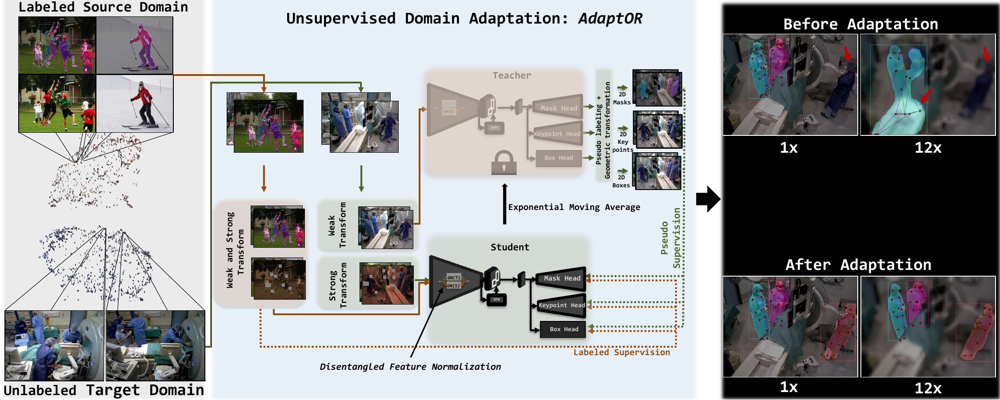

<div align="center">
<a href="http://camma.u-strasbg.fr/">

</a>
</div>


**AdaptOR: Unsupervised Domain Adaptation on low-resolution OR images for joint Human Pose Estimation and Instance Segmentation**

_Vinkle Srivastav, Afshin Gangi, Nicolas Padoy_


[](https://arxiv.org/abs/2108.11801) [](https://colab.research.google.com/drive/1e1Z8B8NWurkXiAbElxirWizyvDsvvUNv?usp=sharing)

# __*AdaptOR*__
<div align="center">
  
</div>

<p float="center">  </p>


## Installation requirements
- Python ≥ 3.6, PyTorch ≥ 1.5, and torchvision with matching PyTorch version.
- Detectron2: follow the [INSTALL.md](https://github.com/facebookresearch/detectron2/blob/master/INSTALL.md) to install detectron2. 
- Gradio: for the demo `pip install gradio`
- We used python=3.7.8, pytorch=1.6.0, torchvision=0.7, detectron2=0.3, cuda=10.2, and cudnn=7.6.5 in our experiments. 
- Run the following commands to download the repo.
```sh
($)> AdaptOR=/path/to/the/repository
($)> git clone https://github.com/CAMMA-public/adaptor.git $AdaptOR
($)> cd $AdaptOR
```
## Datasets
- Follow the [Datasets.md](https://github.com/facebookresearch/detectron2/blob/master/datasets/README.md) to download the COCO dataset. The directory structure should look as follows.
```shell
adaptor/
└── datasets/
    └── coco/
        ├── train2017/
        ├── val2017/
        └── annotations/
        	├── person_keypoints_train2017.json
        	└── person_keypoints_val2017.json
    ...
```
- We will soon release the TUM-OR dataset needed for the domain adaptation experiments for __*AdaptOR*__


## Model Weights for the __*AdaptOR-SSL*__ experiments

|   Model      |   Supervision  |  AP<sup>bb</sup><sub>person</sub> | AP<sup>kp</sup><sub>person</sub>  | AP<sup>mask</sup><sub>person</sub> | Model Weights |
| :----------: | :------------: | :---: |:-----:  |:-----: |:-----:       |
| MoCo-v2_R_50_detectron2    | -   | - | - | - | [download](https://s3.unistra.fr/camma_public/github/adaptor/models/R-50_moco_v2.pkl) |
| [kmrcnn_R_50_FPN_3x_gn_amp_sup1](configs/ssl_coco/kmrcnn_R_50_FPN_3x_gn_amp_sup1.yaml)    | 1%   | 42.57 | 38.22 | 36.06 | [download](https://s3.unistra.fr/camma_public/github/adaptor/models/kmrcnn_R_50_FPN_3x_gn_amp_sup1.pth) |
| [kmrcnn_R_50_FPN_3x_gn_amp_sup2](configs/ssl_coco/kmrcnn_R_50_FPN_3x_gn_amp_sup2.yaml)    | 2%   | 45.37 | 44.08 | 38.96 | [download](https://s3.unistra.fr/camma_public/github/adaptor/models/kmrcnn_R_50_FPN_3x_gn_amp_sup2.pth) |
| [kmrcnn_R_50_FPN_3x_gn_amp_sup5](configs/ssl_coco/kmrcnn_R_50_FPN_3x_gn_amp_sup5.yaml)    | 5%   | 49.90 | 49.79 | 43.10 | [download](https://s3.unistra.fr/camma_public/github/adaptor/models/kmrcnn_R_50_FPN_3x_gn_amp_sup5.pth) |
| [kmrcnn_R_50_FPN_3x_gn_amp_sup10](configs/ssl_coco/kmrcnn_R_50_FPN_3x_gn_amp_sup10.yaml)  | 10%  | 52.70 | 56.65 | 45.46 | [download](https://s3.unistra.fr/camma_public/github/adaptor/models/kmrcnn_R_50_FPN_3x_gn_amp_sup10.pth) |
| [kmrcnn_R_50_FPN_3x_gn_amp_sup100](configs/ssl_coco/kmrcnn_R_50_FPN_3x_gn_amp_sup100.yaml)| 100% | 57.50 | 66.20 | 49.90 | [download](https://s3.unistra.fr/camma_public/github/adaptor/models/kmrcnn_R_50_FPN_3x_gn_amp_sup100.pth) |

## Evaluation
First, download the pre-trained models and copy inside the $AdaptOR/models. Run the [eval_ssl_coco.sh](eval_ssl_coco.sh) or see the following bash script for the evaluation of __*AdaptOR-SSL*__ on the COCO dataset with different percentages of supervision. 
```sh
PERCENTAGE_SUPERVISION=1 #2,5,10,100
CONFIG_FILE=./configs/ssl_coco/kmrcnn_R_50_FPN_3x_gn_amp_sup${PERCENTAGE_SUPERVISION}.yaml
MODEL_WEIGHTS=./models/kmrcnn_R_50_FPN_3x_gn_amp_sup${PERCENTAGE_SUPERVISION}.pth
python train_net.py \
      --eval-only \
      --config ${CONFIG_FILE} \
      MODEL.WEIGHTS ${MODEL_WEIGHTS}
```


## Training
Run the [train_ssl_coco.sh](train_ssl_coco.sh) or see the following bash script for the training of __*AdaptOR-SSL*__ on the COCO dataset with different percentages of supervision on 4 V100 GPUS. To train on more or less GPUs, follow the [linear scaling rule.](https://arxiv.org/abs/1706.02677)
```shell
PERCENTAGE_SUPERVISION=1 #2,5,10,100
CONFIG_FILE=./configs/ssl_coco/kmrcnn_R_50_FPN_3x_gn_amp_sup${PERCENTAGE_SUPERVISION}.yaml
python train_net.py \
      --num-gpus 4 \
      --config ${CONFIG_FILE} \
```
Training on the TUM-OR dataset for the domain adaptation experiments for __*AdaptOR*__ coming soon. 

## [Gradio Demo](https://www.gradio.app/)
Download the pre-trained models and copy inside the $AdaptOR/models
```sh
($)> python AdaptOR-SSL_demo_image.py
```

## Demo outputs
Sample output of __*AdaptOR*__ comparing the model before and after the domain adaption on the downsampled images with downsampling factor of 8x (80x60)
<p float="center">  </p>


Sample output of __*AdaptOR-SSL*__ comparing the model trained with 1% vs. 100% supervision
<p float="center">  </p>


## Citation
```bibtex
@inproceedings{srivastav2021adaptor,
  title={AdaptOR: Unsupervised Domain Adaptation on low-resolution OR images for joint Human Pose Estimation and Instance Segmentation},
  author={Srivastav, Vinkle and Gangi, Afshin and Padoy, Nicolas},
  booktitle={Medical Image Analysis},
  year={2022},
}
```
## References
The project uses [detectron2](https://github.com/facebookresearch/detectron2/). We thank the authors of detectron2 for releasing the library. If you use detectron2, consider citing it using the following BibTeX entry.

```bibtex
@misc{wu2019detectron2,
  author =       {Yuxin Wu and Alexander Kirillov and Francisco Massa and
                  Wan-Yen Lo and Ross Girshick},
  title =        {Detectron2},
  howpublished = {\url{https://github.com/facebookresearch/detectron2}},
  year =         {2019}
}
```
The project also leverages following research works. We thank the authors for releasing their codes.
- [Unbiased-Teacher](https://github.com/facebookresearch/unbiased-teacher)
- [Rand-Augment and Rand-Cut](https://github.com/jizongFox/pytorch-randaugment)
- [Pytorch Image Models](https://github.com/rwightman/pytorch-image-models)
- [MoCo-v2](https://github.com/facebookresearch/moco) pre-trained weights are used to initialize the __*AdaptOR-SSL*__ models. The MoCo-v2 weights in the detectron2 format is available here [MoCo-v2-detectron2](https://s3.unistra.fr/camma_public/github/adaptor/models/R-50_moco_v2.pkl). The config files by default download the weights from our S3 server. You can also use this [script](https://github.com/facebookresearch/moco/blob/master/detection/convert-pretrain-to-detectron2.py) to convert the MoCo-v2 weights to the detectron2 format. 


# License
This code, models, and datasets are available for non-commercial scientific research purposes as defined in the [CC BY-NC-SA 4.0](https://creativecommons.org/licenses/by-nc-sa/4.0/). By downloading and using this code you agree to the terms in the [LICENSE](LICENSE). Third-party codes are subject to their respective licenses.

